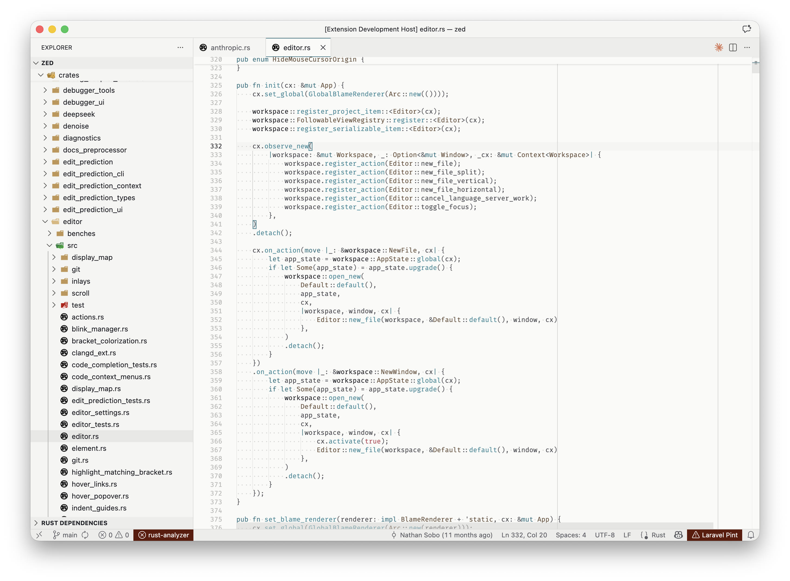
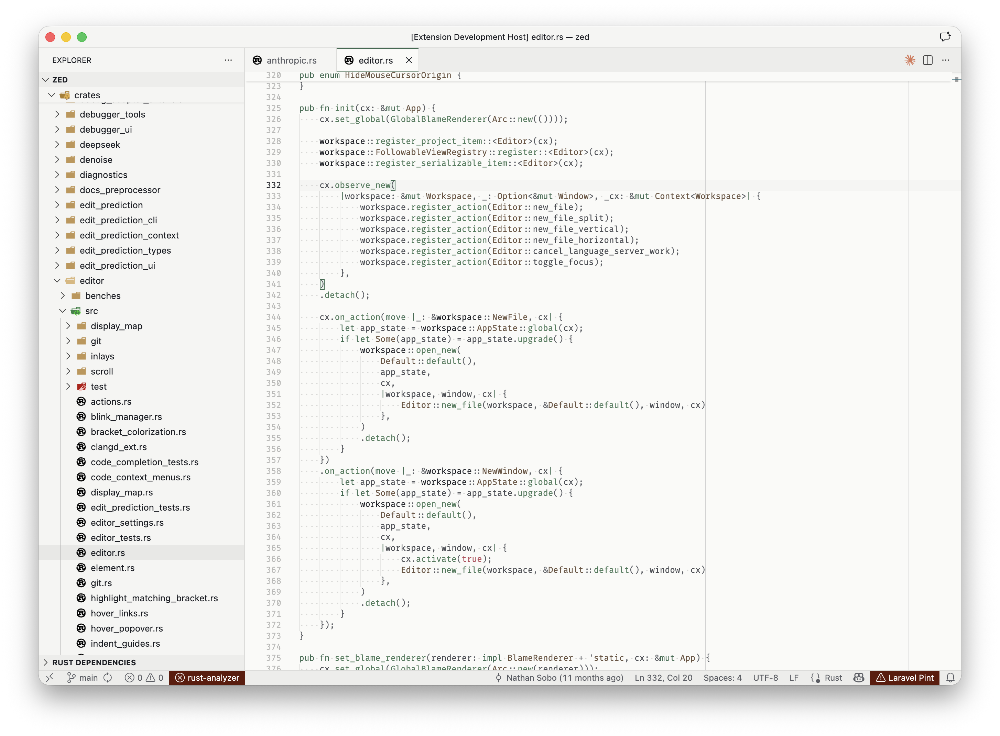
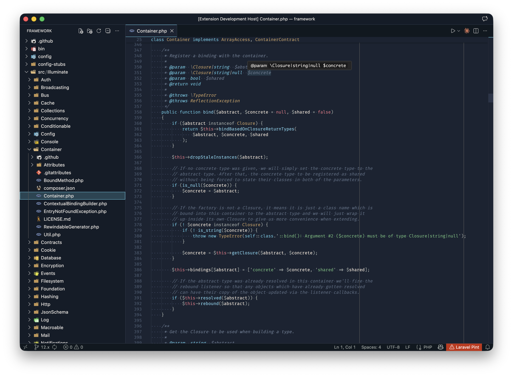
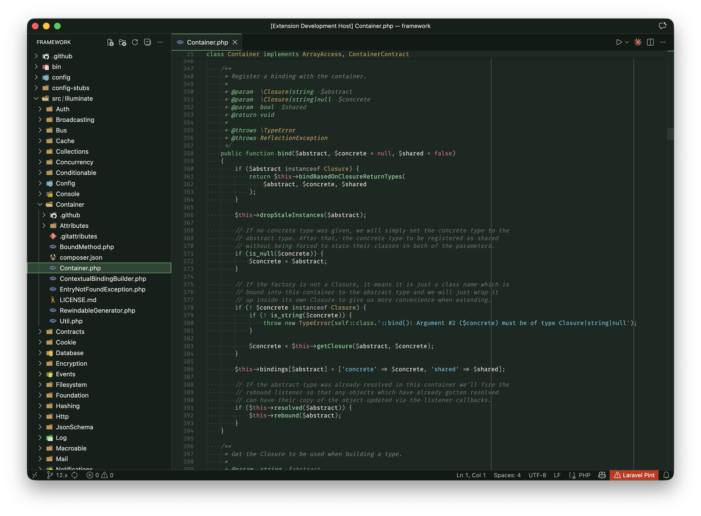

# Formosa Theme for VS Code

A color theme inspired by the [**Porsche 911 Carrera T "Formosa"**](https://www.porsche.com/taiwan/en/campaign/911-carrera-t-formosa/) — a one-of-one Sonderwunsch creation celebrating Taiwan's beauty.

> "Formosa" — the name given to Taiwan by Portuguese sailors in the 16th century, meaning "Beautiful Island."

## Disclaimer

This project is not affiliated with, endorsed by, or sponsored by Porsche AG. "Porsche", "911 Carrera T", and related marks are trademarks of Porsche AG. This theme is an independent fan creation inspired by publicly available images.

## Themes

| Theme | Appearance | Primary Color |
|-------|------------|---------------|
| **Formosa Light - Ipanema Blue** | Light | Ocean Blue |
| **Formosa Light - Night Green** | Light | Forest Green |
| **Formosa Dark - Ipanema Blue** | Dark | Ocean Night |
| **Formosa Dark - Night Green** | Dark | Forest Night |

## Screenshots

### Formosa Light - Ipanema Blue

### Formosa Light - Night Green

### Formosa Dark - Ipanema Blue

### Formosa Dark - Night Green

## Color Palette

All colors are extracted from the Porsche 911 Carrera T "Formosa", created by Porsche's Sonderwunsch (Special Wishes) program:

### Source Colors

| Color Name | HEX | Source | Role |
|------------|-----|--------|------|
| **Ipanema Blue** | `#4a90a4` | Main body (Paint to Sample) | Keywords (Blue themes) |
| **Night Green** | `#5a8a6a` | Seat fabric pattern | Keywords (Green themes) |
| **Paldao Wood** | `#8b7355` | Dashboard wood trim | Types, Classes |
| **Truffle Brown** | `#a67c52` | Interior leather | — |
| **Cream White** | `#e6e1d3` | Seat fabric pattern | Background base |
| **Suzuka Grey** | `#6e7681` | Wheel accents | Comments |

### Theme Variants

Colors are adjusted for optimal readability while preserving the Porsche aesthetic:

| Variant | Approach |
|---------|----------|
| **Light themes** | Deepened for contrast on cream backgrounds |
| **Dark themes** | Brightened for vibrancy on dark backgrounds |

## Installation

### From VS Code Marketplace

1. Open **Extensions** sidebar (`Cmd+Shift+X` / `Ctrl+Shift+X`)
2. Search for `Formosa Theme`
3. Click **Install**
4. Open **Command Palette** (`Cmd+Shift+P` / `Ctrl+Shift+P`)
5. Type `Preferences: Color Theme` and select a Formosa variant

### Manual Installation

1. Clone this repository
2. Run `npm install -g @vscode/vsce`
3. Run `vsce package`
4. Run `code --install-extension formosa-theme-1.0.0.vsix`

## Inspiration

The [Porsche 911 Carrera T "Formosa"](https://www.porsche.com/taiwan/en/campaign/911-carrera-t-formosa/) is a unique Sonderwunsch creation celebrating Taiwan's natural beauty:

- **Exterior**: Ipanema Blue Metallic with Suzuka Grey accents
- **Interior**: Paldao wood trim, Truffle Brown & Black leather with Night Green stitching
- **Special**: Custom "Formosa" checkered pattern in Night Green, Black, and Cream White

### Design Philosophy

- **Light themes**: Like sitting in the cream leather interior, looking out at Taiwan's coastline or mountains
- **Dark themes**: Standing on Taiwan's coast or in its forests at night, with Porsche colors glowing under starlight

## Also Available For

- [Zed Editor](https://github.com/takeshiyu/formosa-zed-theme)

## License

MIT License - see [LICENSE](LICENSE) for details.

---

*Beautiful Island • 福爾摩沙 • 美麗之島*
